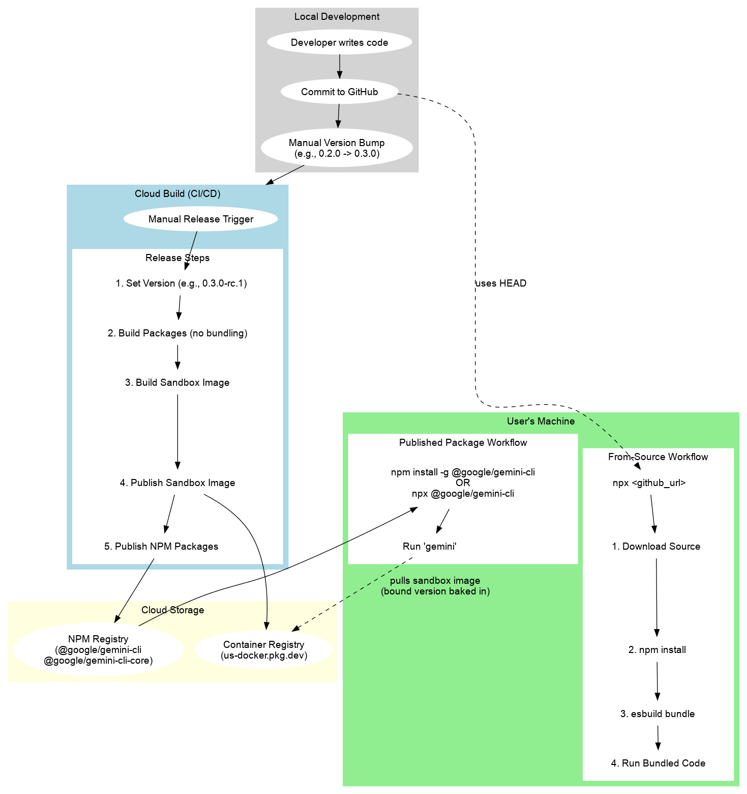
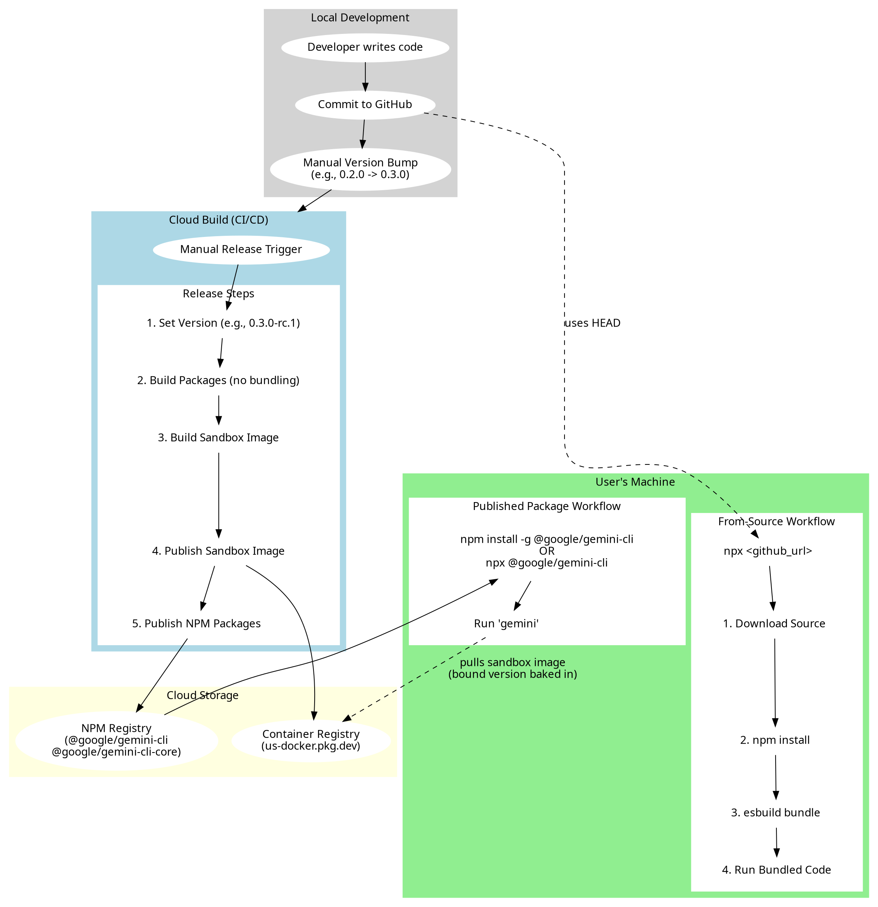

# Document Purpose: Architectural Archaeology

This document serves as an architectural record of the Gemini CLI's release and package distribution models. As we evolve our release processes, this document is intended to preserve the history and justifications behind the original monorepo structure and the dual-workflow release system. It is a tool for "architectural archaeology," allowing future maintainers to understand the context of past decisions, which is crucial for making informed decisions in the future.

---

# Release and Distribution Workflows

This document outlines the two primary workflows for releasing and distributing the Gemini CLI. Understanding both is crucial for maintaining and supporting the project.

## Architectural Context: The Monorepo and Two-Package Structure

It is important to first understand why the repository is structured as a monorepo containing two distinct packages: `@google/gemini-cli` and `@google/gemini-cli-core`.

Initially, the application was a single, monolithic package. A deliberate architectural decision was made to decouple the core business logic (model interaction, tool handling, etc.) from the user interface (the React-based CLI).

*   `@google/gemini-cli-core`: This package contains the foundational, reusable logic. The intention was for this core package to serve as a base for building various types of Gemini clients in the future.
*   `@google/gemini-cli`: This package is one such client—the interactive terminal UI that most users see.

This repository uses **NPM Workspaces** to manage the monorepo structure. This has a direct impact on how dependencies between the packages are handled during local development. In the `packages/cli/package.json`, you will notice that `@google/gemini-cli-core` is listed as a dependency with a `*` version number.

When you run `npm install` at the root of the repository, NPM does not download the `@google/gemini-cli-core` package from the NPM registry. Instead, thanks to the workspaces feature, it creates a **symlink** in the `packages/cli/node_modules` directory that points directly to the local `packages/core` directory. This allows for seamless local development, where changes in the `core` package are immediately reflected in the `cli` package without needing to publish and reinstall.

---

## 1. Published Package Workflow (e.g., `npm install -g @google/gemini-cli`)

This is the standard, production-ready release mechanism for providing stable, versioned releases to our users. The entire process is automated through the `.gcp/release.yaml` configuration file, which orchestrates a series of build, test, and publish steps. This workflow is used when a user installs the CLI from the NPM registry, either globally (`npm install -g`) or for one-off execution (`npx @google/gemini-cli`).

### High-Level Process:

1.  **Manual Trigger:** The Cloud Build release job is **manually triggered** when we are ready to cut a new release. It is not automatic on every commit.
2.  **Versioning:**
    *   The release process uses the `version` in the root `package.json` as the base. By default, it appends an `rc` (release candidate) identifier. For an official release, the `_OFFICIAL_RELEASE` variable is set to `true`.
    *   This means that for a new official release (e.g. `0.3.0`), a developer must first manually commit a version bump in `package.json` to `0.3.0` so that subsequent `rc` releases are correctly based on it (e.g., `0.3.0-rc.1`).
3.  **Build & Preparation:**
    *   All workspace packages are built, compiling TypeScript to JavaScript and copying necessary assets (`.md`, `.json`, `.sb` files) to the `dist` directory.
    *   The `packages/cli/package.json` is dynamically updated to include the URI of the corresponding sandbox Docker image.
    *   The root `README.md` and `LICENSE` files are copied into each workspace package directory to ensure they are included in the final NPM package.

4.  **Sandbox Image:**
    *   A Docker image is built using the `Dockerfile` at the root of the project. This image contains the packed `.tgz` versions of the `cli` and `core` packages.
    *   This sandbox image is then pushed to our designated container registry (e.g., Google Artifact Registry).

5.  **Publishing:**
    *   The `@google/gemini-cli-core` and `@google/gemini-cli` packages are published to the NPM registry. This is achieved by running `npm publish --workspace=<package_name>`, which effectively runs the standard `npm publish` command from within that package's subdirectory.
    *   `npm publish` has its own lifecycle scripts (e.g., `prepublishOnly`) that are triggered. It is important to be familiar with this standard NPM behavior. See the [official documentation](https://docs.npmjs.com/cli/v8/using-npm/scripts#npm-publish) for more details.
    *   The release is tagged as `latest` for official releases or `rc` for release candidates, controlling the version users get by default.

### Key Characteristics:

*   **Source:** Pre-built, versioned packages from the NPM registry.
*   **Stability:** Represents a stable, tested, and production-ready state of the application.
*   **Use Case:** The recommended installation method for most users.
*   **Local Dev Alignment:** This workflow of using pre-transpiled files in the `dist` directory closely aligns with the local development scripts `npm run start` and `npm run debug`, which also target the output of `tsc`.

---

## 2. From-Source Workflow (e.g., `npx https://github.com/google-gemini/gemini-cli`)

This workflow provides a way for users and developers to run the CLI directly from the source code in our GitHub repository. The key distinction is running from a **GitHub URL** rather than an NPM package name.

### Historical Context and Rationale

This from-source workflow was specifically implemented to facilitate early access to the application for internal users and early testers. Before the package was publicly released, this method proved simpler than managing access to a private NPM registry. By granting users access to the GitHub repository, they could immediately run the latest version of the code.

However, this required a build step on the user's machine. To make this seamless, the `bundle` step was introduced, using `esbuild` to create a single, self-contained executable.

### How It Works:

The magic behind this workflow is the `prepare` script in our root `package.json`. When a user runs `npx <git-url>`, `npx` does the following:

1.  **Downloads Source:** It temporarily downloads the source code from the `main` branch of the GitHub repository.
2.  **Installs Dependencies:** It runs `npm install` to fetch all dependencies.
3.  **Runs `prepare` Script:** NPM automatically executes the `prepare` script, which is configured to run our `bundle` command.
4.  **Bundles Code:** The `bundle` script uses `esbuild` to compile and bundle the entire CLI application, starting from `packages/cli/index.ts`, into a single, executable JavaScript file: `bundle/gemini.js`. It also copies necessary assets (like `.sb` sandbox profiles) into the `bundle/` directory.
5.  **Executes Binary:** `npx` then executes the binary specified in the `bin` field of `package.json`, which points to the newly created `bundle/gemini.js`.

### Known Incompatibilities
*   **NPM Version:** Older versions of NPM may default to looking for a `master` branch instead of `main` when resolving the GitHub URL, which can cause this workflow to fail. This is addressed in PR [#1456](https://github.com/google-gemini/gemini-cli/pull/1456).

### Key Characteristics:

*   **Source:** The latest commit from the `main` branch of the GitHub repository.
*   **Build Process:** The build and bundling happen on-demand, on the user's machine, every time the command is run.
*   **Use Case:** Primarily for development, testing cutting-edge features, and running the CLI without a global installation.

---

## The Nuance of "Package" and `package.json`

A key point of complexity is how the term "package" is interpreted in each workflow and which `package.json` is used.

*   **Published Package Workflow:** The `npm publish` command operates on the current working directory. Since we publish two distinct packages (`@google/gemini-cli` and `@google/gemini-cli-core`), our release script publishes each one from its respective subdirectory (`packages/cli` and `packages/core`). Therefore, for publishing, the `package.json` inside each subdirectory is the manifest for that specific NPM package.

*   **From-Source Workflow:** The `npx <git-url>` command treats the *entire repository* as a single package. It looks for a `package.json` in the root of the repository to determine dependencies and which binary to execute. Therefore, for this workflow, the *root* `package.json` is the primary manifest.

The root `package.json` also serves as the central hub for all development scripts (`build`, `test`, `lint`, etc.) that operate across the entire workspace.

## Versioning, Sandboxing, and the Source of Truth

The interplay between versioning and the sandboxing mechanism highlights a critical distinction between the two workflows.

In the **Published Package** workflow, the process is deterministic and tightly coupled:
1. A sandbox image is built and tagged with a specific version number (e.g., `0.2.0`).
2. This image is published to our container registry.
3. The `@google/gemini-cli` NPM package is then prepared. The *exact same version number* (`0.2.0`) is used to construct the full sandbox image URI, which is then **baked into the `package.json`** of the `cli` package.
4. The `cli` package is then published to NPM.

In this flow, the `package.json` of the published NPM package becomes the immutable source of truth. When a user installs `@google/gemini-cli@0.2.0`, the CLI knows to pull the sandbox image tagged with `0.2.0`. The version number acts as the binding agent between the application code and its sandboxed environment.

This breaks down in the **From-Source Workflow**. Since this flow runs directly from a git commit (e.g., the `HEAD` of `main`), the version number in the root `package.json` is not necessarily representative of a formal release and may not have a corresponding published sandbox image. This can create confusion and potential mismatches if not handled carefully. For development and testing using this flow, the sandbox must be managed locally.

### Sandbox Versioning Weirdness

A specific operational challenge arises from this dichotomy. The `sandboxImageUri` field in the root `package.json` is used during local development and the from-source workflow. Because the `version` field in that same file might be set to the *next* target release (e.g., `0.4.0`) for which a sandbox has not yet been published, the `sandboxImageUri` must point to the *last known good* published version (e.g., `us-docker.pkg.dev/.../sandbox:0.3.0`).

This is not an issue for the published package workflow, because the `sandboxImageUri` in the `packages/cli/package.json` is dynamically updated with the correct, matching version number during the release process itself. This is a crucial manual check during development.

## Future Architectural Considerations

This section captures potential architectural improvements and topics for future discussion.

### Automating and Consolidating Versioning

The current manual version bumping process is a known point of friction and potential error.
*   **The Problem:** The release trigger relies on the `version` in the root `package.json` already being set to the *next* target version. This is confusing when reading the source, as `main` may reflect a version that hasn't been released.
*   **Potential Solution:** A more robust, automated system could be implemented. Such a system could query the NPM registry for the latest published version, automatically calculate the next patch/minor version, create the version bump commit, and merge it back after a successful release. This would make the `main` branch always reflect the *current* stable release version.

Furthermore, the version number is currently maintained in three separate `package.json` files. While the `prerelease:dev` script syncs them, a single source of truth would be ideal. However, this is complicated by the fact that the root `package.json` is not the manifest for the published packages. Any consolidation effort must account for this nuance.

### To Bundle or Not To Bundle?

Currently, only the from-source (`npx <github-url>`) workflow uses a bundler (`esbuild`). The standard published package workflow ships transpiled `.js` files that rely on Node's module resolution and the `node_modules` directory.

There is an argument for introducing a bundling step to the standard build process for the `@google/gemini-cli` package.

**Potential Benefits:**
*   **Performance:** Could lead to faster startup times by reducing the number of file I/O operations.
*   **Consistency:** Would align the build artifact of both workflows.

**Considerations and Open Questions:**
*   **Development Workflow:** Adding a bundling step could increase the friction between saving a source file and running the updated code, potentially complicating the local development loop.
*   **Package Granularity:** Should the `core` and `cli` packages be bundled independently, or should the `cli` package bundle the `core` package's code within it?
*   **Build Context:** Should the bundling happen from the repository root (like the current from-source flow) or from within the `packages/cli` directory to more closely align the bundled output with the package being published?

A decision to move forward with this would require careful consideration to ensure that the developer experience is not negatively impacted.

## Comparison Summary

| Feature | Published Package Workflow | From-Source (GitHub URL) Workflow |
| :--- | :--- | :--- |
| **Source** | Pre-built packages from the NPM registry. | Source code directly from the `main` branch of the GitHub repository. |
| **Versioning** | Uses the specific version of the published package (e.g., `0.1.9`). | Uses the latest commit on the `main` branch. |
| **Build Artifact** | Source files are **transpiled** from TypeScript to JavaScript, preserving the file structure. | The entire application is **bundled** into a single executable JavaScript file. |
| **Dependency Model** | Dependencies are managed and installed by the user's package manager (npm/yarn) based on the package manifest. | All dependencies are bundled into the single output file; no external `node_modules` are required at runtime. |
| **`package.json` Used**| The `package.json` within each `packages/*` subdirectory is used for publishing to NPM. | The root `package.json` is used to define the entry point and dependencies for the on-demand build. |
| **Sandbox Binding** | The version number baked into the published `package.json` links to a specific, version-tagged sandbox image in the registry. | No guaranteed link to a published sandbox image. Relies on local sandbox management for development. |
| **Stability** | Stable, versioned, and production-ready. | "Bleeding edge," contains the latest unreleased changes. |
| **Primary Audience** | End-users. | Developers, testers, and advanced users. |

---

## Visual Workflow Diagram

